# REDA (Red de Apoyo para Cuidadores)

## Índice

* [1. Preámbulo: introducción a la app](#1.-Preámbulo:-introducción-a-la-app)
* [2. ¿Qué es REDA?, resumen del proyecto.](#2.-¿Qué-es-REDA?,-resumen-del-proyecto)
* [3. Características generales de la aplicación:](#3.-criterios-de-aceptación-mínimos-del-proyecto)
* [4. Definición del producto ](#4.-Definición-del-producto)
* [5. Historias de usuario ](#5.-Historias-de-usuario)
* [6. Diseño de la Interfaz de Usuario (prototipo de baja fidelidad)](#6.-Diseño-de-la-Interfaz-de-Usuario-(prototipo-de-baja-fidelidad))
* [7. Diseño de la Interfaz de Usuario (prototipo de alta fidelidad)](#7.-Diseño-de-la-Interfaz-de-Usuario-(prototipo-de-alta-fidelidad))
* [8. Diseño responsivo de la interfaz de usuario.](#8.-Diseño-responsivo-de-la-interfaz-de-usuario.)
* [9. Creación de cuenta de usuario e inicio de sesión ](#9.-Creación-de-cuenta-de-usuario-e-inicio-de-sesión)
* [10. Consideraciones técnicas Front-end](#10.-Consideraciones-técnicas-Front-end)
* [11.Pruebas unitarias (unit tests)](#11.-Pruebas-unitarias-(unit-tests))

## 1. Preámbulo: introducción a la app

Buscamos diseñar una red social inclusiva, dedicada a la interacción entre, por un lado:
a). Personas que tengan menores de edad bajo su cuidado, y por el otro:
b). profesionistas dedicadxs al cuidado infantil.

Es por ello que, desde el titulo de la app, optamos por utilizar la palabra "cuidador", 
en vez de "padres" o "madres", buscando enfatizar que en la app es un espacio que busca destacar
la diversidad de personas que se dedican al cuidado infantil: (padrxs, madrxs, abuelxs, profesorxs, niñerxs, etc.) 
sin dar por sentado que algún rol es mas relevante que otro, ya que cada contexto de crianza
es particular.

## 2. ¿Qué es REDA?, resumen del proyecto.

La particularidad de nuestra red social, es que los usuarios pueden tener dos roles: 
a). Experto.  y 
b). Cuidador.

Los usuarios que pueden registrarse como a). "experto" en la app, es porque cuentan con algún titulo universitario,
certificación o especialidad que respalda la veracidad de su conocimiento, y por ende de sus publicaciones. 

Los usuarios con el rol de b). "cuidador" pueden dar like a las publicaciones, y hacer comentarios sobre ellas.
Pero no pueden hacer publicaciones. 

El objetivo de lo anterior, es que REDA se constituya como un espacio seguro, donde los cuidadores puedan informarse 
sobre temas de interés de la mano de expertos, asegurándose de que la información que estan consumiendo tiene algun tipo
de respaldo profesional.

## 3. Características generales de la aplicación:

* Es un SPA.
* Cada vista cuenta con un diseño responsivo.
* Cuenta con la implementación de un router para la navegación entre las diferentes vistas de la app.
* Emplea un servicio externo (firebase y firestore) para el manejo y la persistencia de la información. 
* Cuenta con una suite de pruebas unitarias asíncronas. 

### Invenstigación.
A partir de una explioración con usuarios potenciales de la app:(1 padre de familia biparental,
1 madre de familia monoparental, y un psicógo experto en crianza), identificamos que la principal preocupación de 
los tres usuarios es la dificultad para verificar si la fuente de información que estan consumiendo es 
veridica y confiable, o si tiene algún sustento cientifico.

A partir de lo anterior, decidimos que REDA tendria que funcionar como un espacio que responda a dicha necesidad:
es por esa razón que unicamente pueden publicar las personas con licencias adecuadas. 
### REDA link:
Reda esta disponible en el siguiente enlace:
https://dev-004-social-network-lwqu2yetm-katalimbu.vercel.app
 
 ## 4. Definición del producto 

  La aplicacion REDA busca acompañar a quienes estan viviendo un proceso de crianza, acogiendo a cualquier persona que cumpla dicha labor.
  Nuestro principal objetivo es que nuestros usuarios encuentren la información confiable y verificada, según las necesidades educativas que cada 
  familia. Para lograrlo, nos apoyamos en profesionales en las áreas de: Educación, Psicología, Fonoaudiología y Pediatría, los cuales desempeñan el rol de especialista 

## 5. Historias de usuario 

  La planeación del proyecto se basó en 10 historias de usuario.
  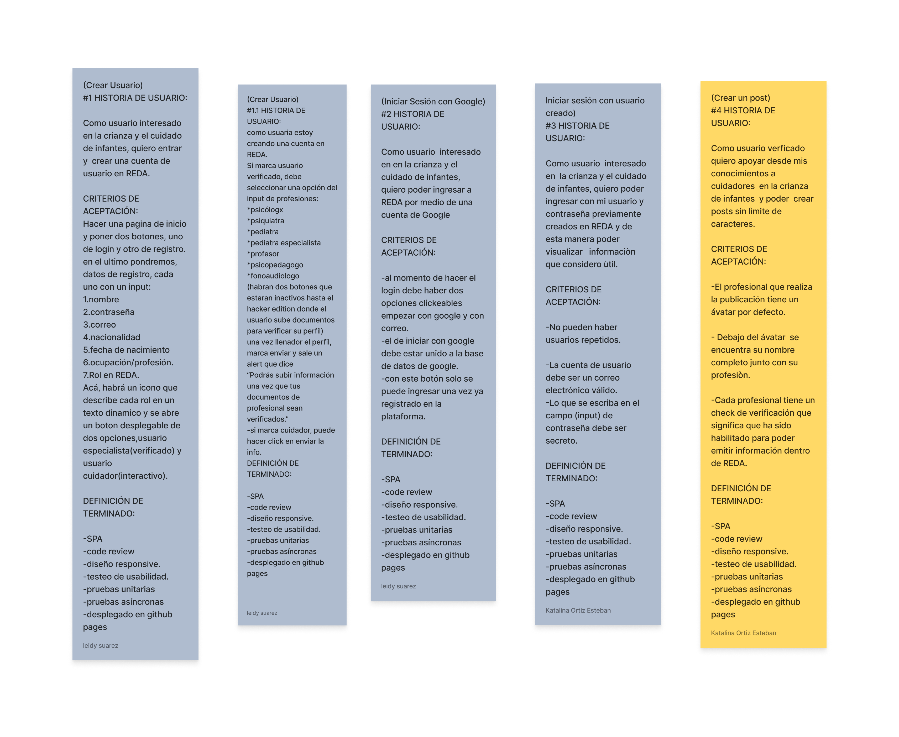
  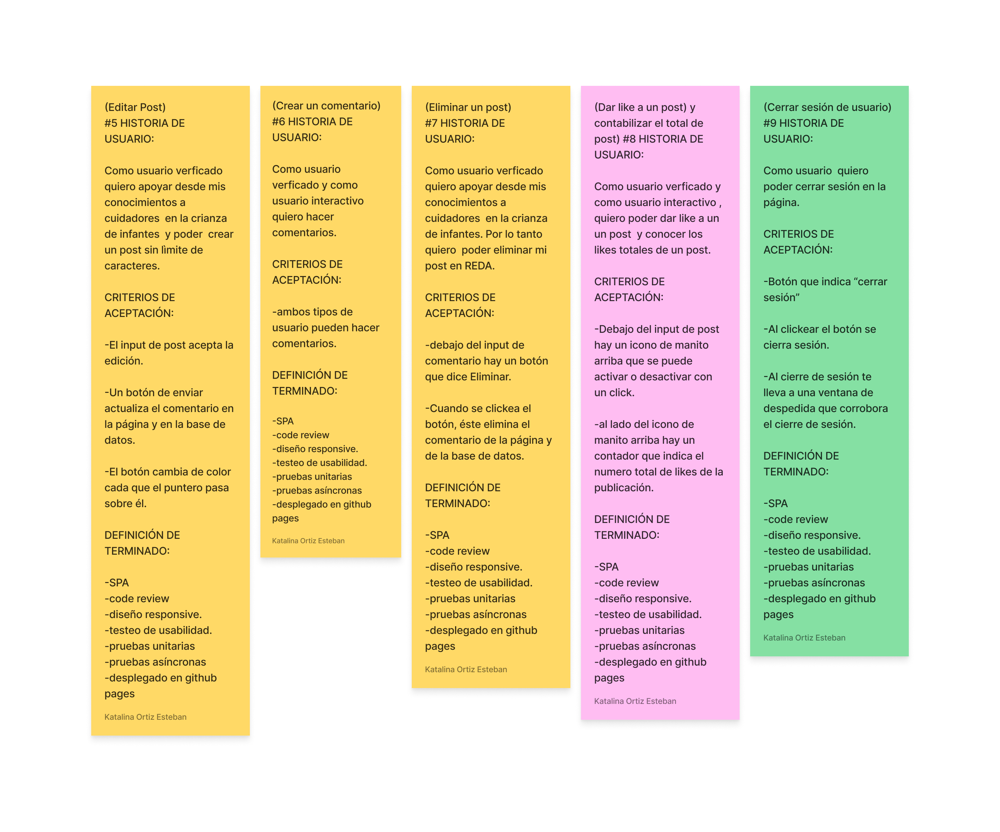
  En el transcurso del proyecto, realizamos modificaciones, las cuales reportamos en las siguientes imágenes:
  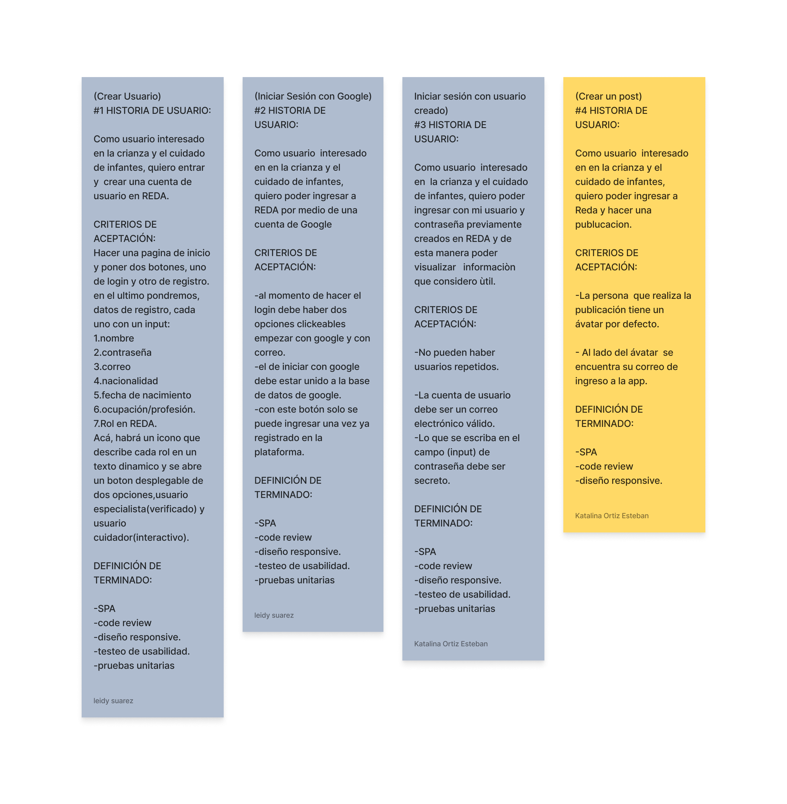
  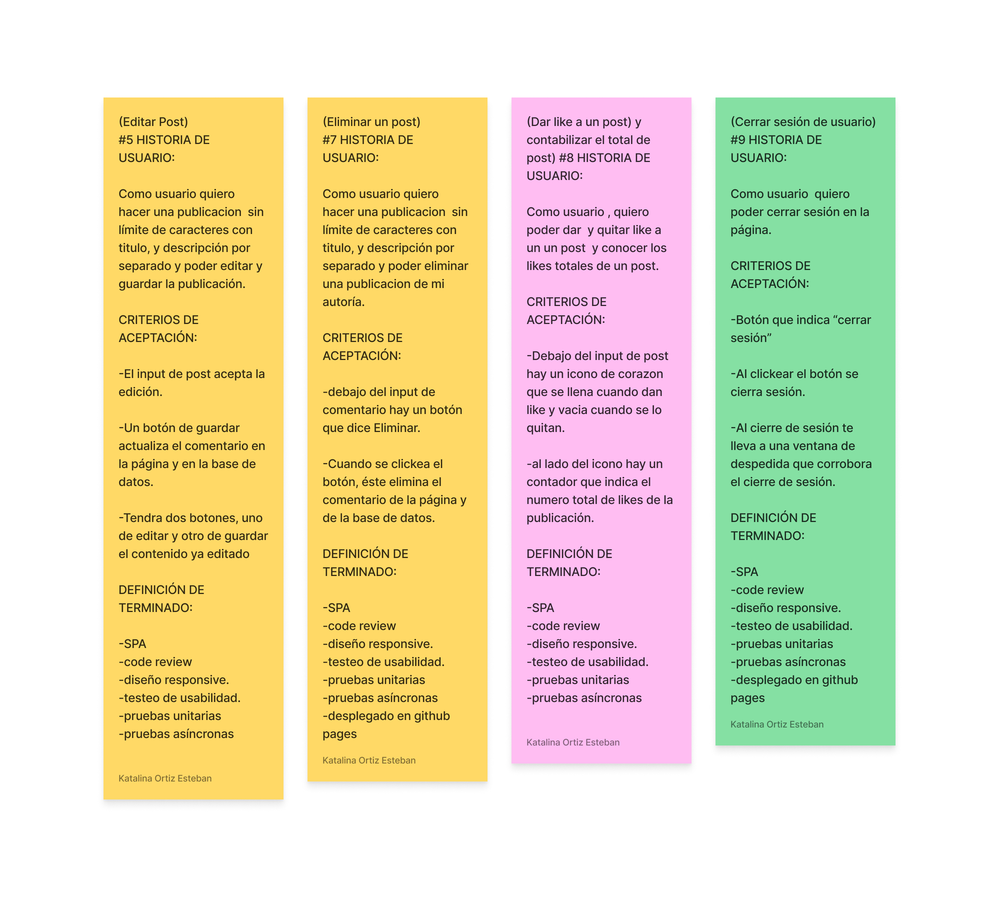

## 6. Diseño de la Interfaz de Usuario (prototipo de baja fidelidad) 

  En las siguientes imágenes encontramos el prototipo de baja fidelidad del proyecto. La idea general es comunicar el registro de dos tipos de usuario en la app.
  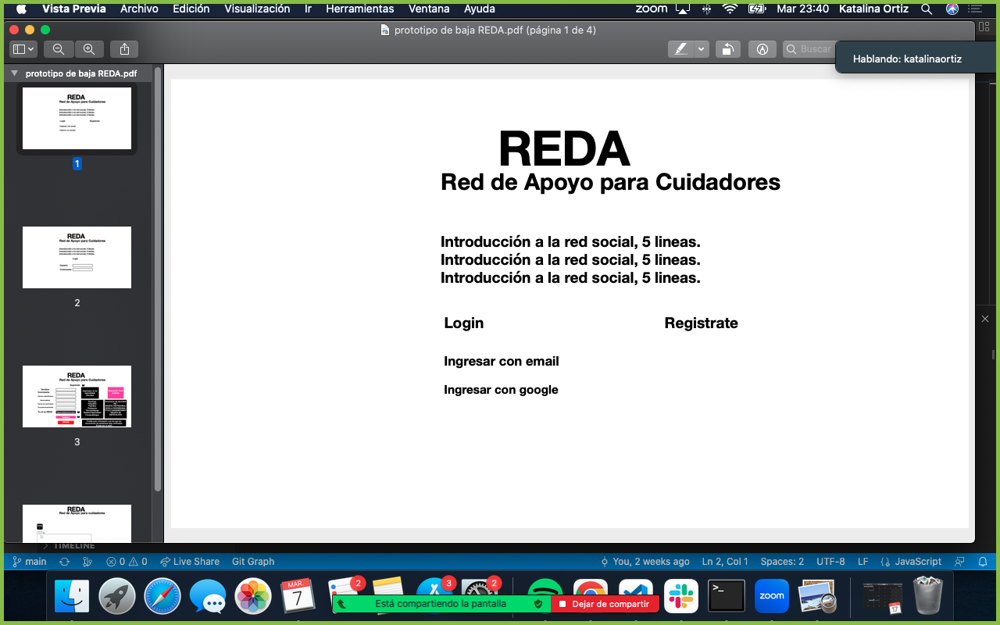
  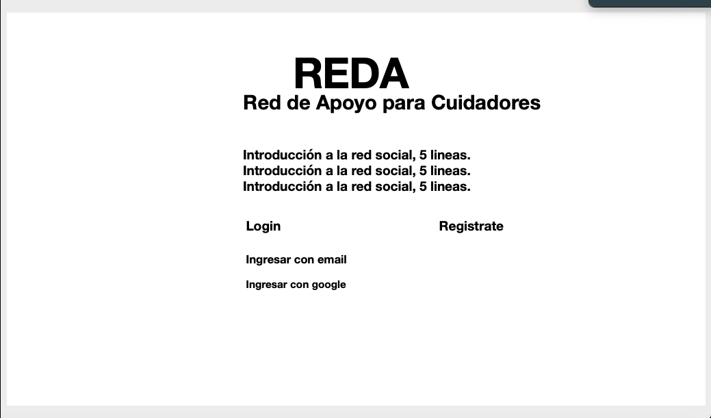
  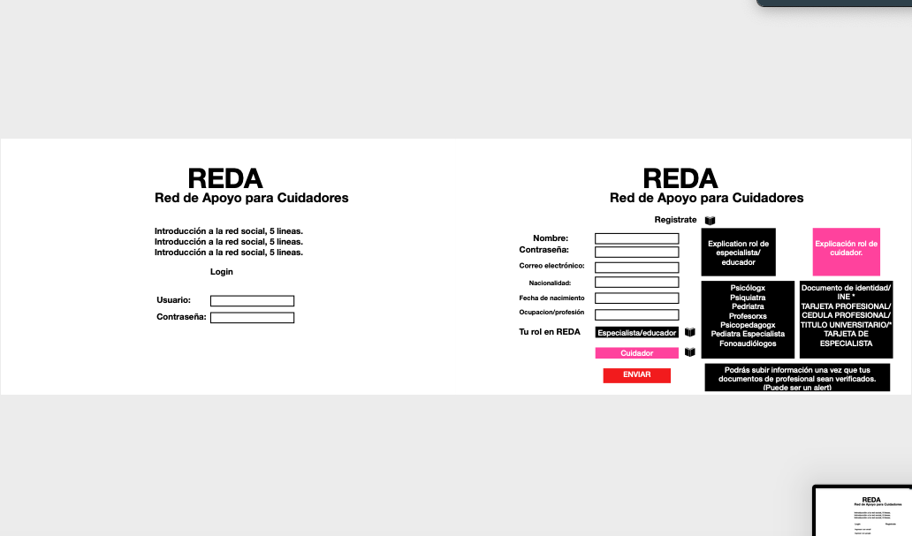
  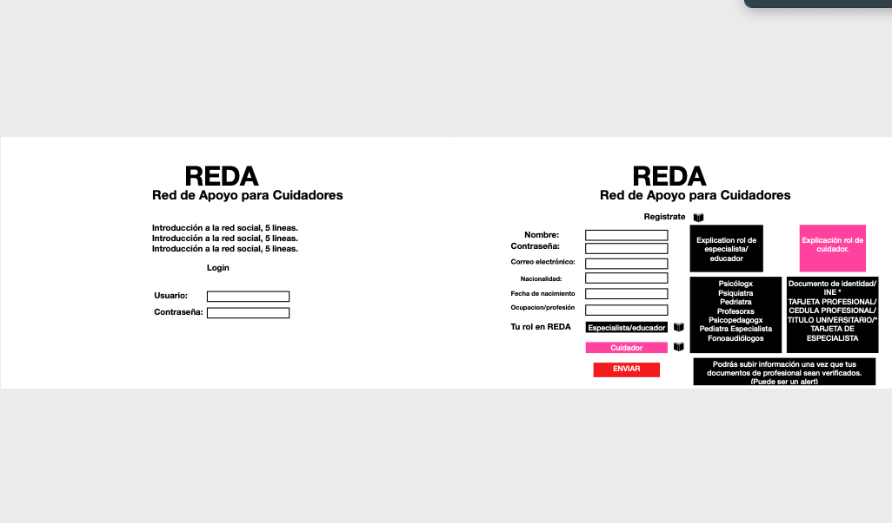
  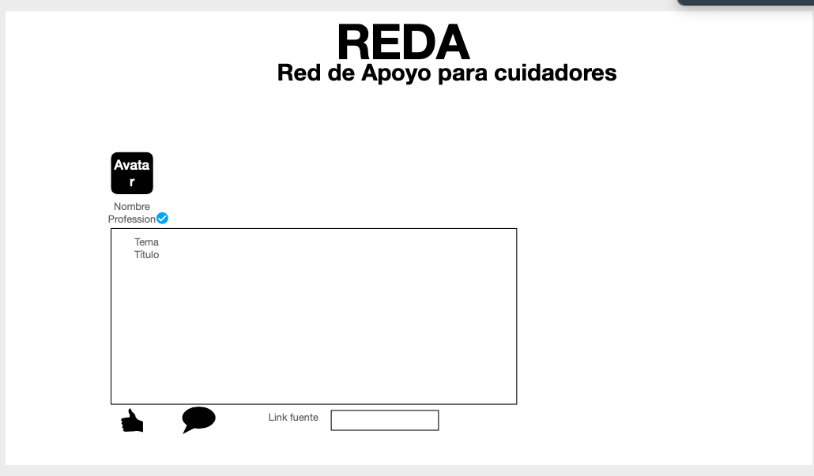

## 7. Diseño de la Interfaz de Usuario (prototipo de alta fidelidad) 

  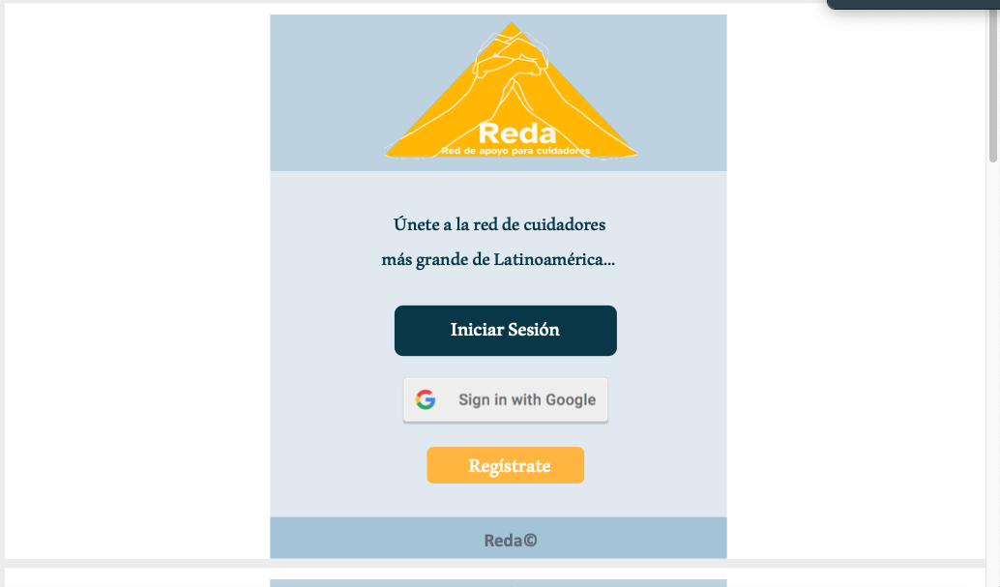
  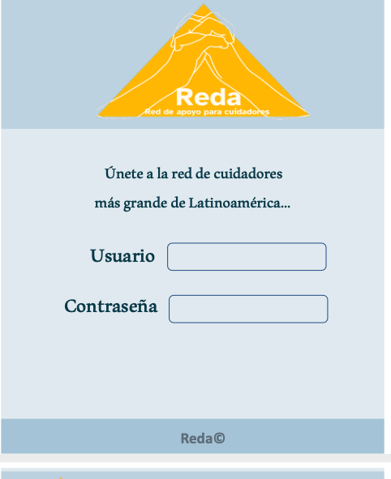
  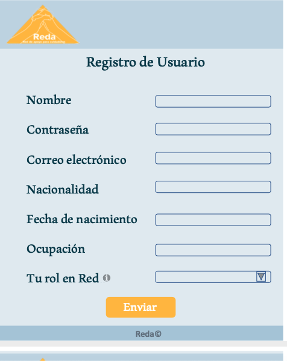
  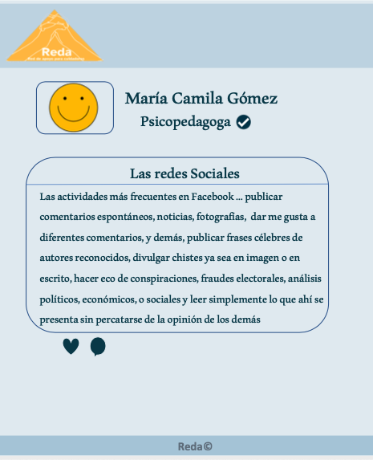
  
## 8. Diseño responsivo de la interfaz de usuario.

  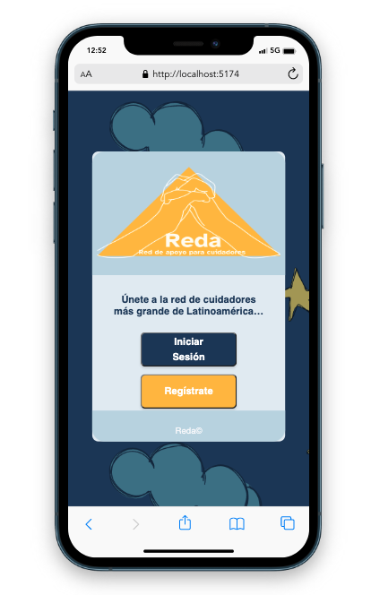
  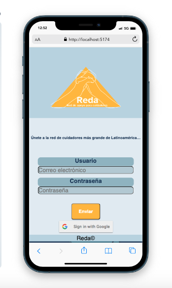
  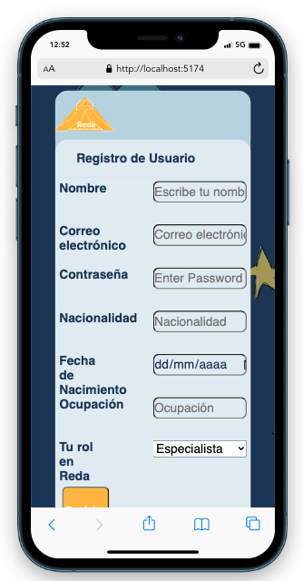
  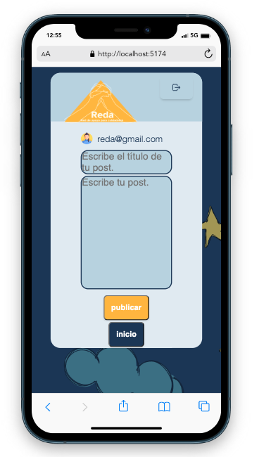
  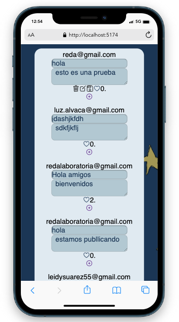

## 9.Creación de cuenta de usuario e inicio de sesión 

En el presente proyecto se implementó Firebase, una plataforma en la nube para el desarrollo de aplicaciones web y móvil de Google. 
Firebase proporciona servicios de backend, SDK fáciles de usar y bibliotecas de interfaz, las cuales  posibilitan la autenticación 
de los usuarios y el almacenamiento de las publicaciones que estos deseen crear.s

Con base en lo anterior, el proyecto REDA posibilita lo siguiente:

* Creación de cuenta e inicio de sesión:
- Crear una cuenta de acceso y autenticación con cuenta de correo y contraseña.
- Iniciar sesión con la cuenta anteriormente creada.
- Iniciar sesión con una cuenta de Google.
 
 Las anteriores funcionalidades cumplen una serie de requisitos (validaciones) y comportamientos escenciales para su correcto funcionamiento.

* Validaciones:
  - Si la cuenta no es válida, el usuario no puede inciar sesión.
  - No puede haber usuarios repetidos.
  - La cuenta de usuario debe ser un correo electrónico válido.
  - Se oculta lo que se escriba en el campo de contraseña.

* Comportamiento:
  - Antes de que el usuario envìe el formulario de registro o inicio de sesión, se valida que los campos no esten vacíos.
  - Cuando hay errores, se muestran una serie de mensajes descriptivos que ayudan al usuario a corregirlos y registrarse/loguearse correctamente.

### Muro/timeline 

 Antes de que el usuario publique contenido de su interés, REDA se encarga de realizar las repectivas validaciones 
 garantizando un adecuado funcionamiento, basados en la validación de usuarios y el comportamiento de la interfaz.

* Validaciones:
  - Al publicar, Reda valida que exista contenido en la caja de texto.
* Comportamiento:
  Es necesario que el usuario haya iniciado sesión antes poder relaizar las siguientes actividades:

  - Ver las publiaciones propias y de otros usuarios.
  - Poder publicar un post.
  - Poder dar y quitar like a una publicación. 
   Cabe aclarar que el usuario solo puede dar like una vez y en la interfaz se visualiza la cantidad de 
  likes que tienen los post.
  - El usuario solo puede  eliminar sus propios posts, no las publiaciones pertenecientes a otros 
     usuarios.
   Se le muestra al usuario una ventana que le pide confirmar antes de eliminar cualquier publicación.
  - El usuario solo puede editar sus propias publicaciones.
  Cuando el usuario modifica un escrito, éste se actualiza y le  permite guardar y publicar los nuevos 
  cambios.
  

## 10. Consideraciones técnicas Front-end 

En el presente proyecto se divideron las responsabilidades permitiendo un funcionamiento sencillo y eficaz.
Es por ello que se creó un archivo Javascript por cada una de las vistas:

- Home: Página de inicio, la cual muestra la opción de inciar sesión o registrarse.
- Register: Página que le indica al usuario la información que debe digitar para registrarse.
- Login: Vista que le posibilita al usuario ya registrado, iniciar sesión. Para el usuario no registrado, existe la opción de ingresar con una cuenta de Google.
- Feed: Implementación de las funciones importadas del archivo Firebase.js que permitieron la funcionalidades de REDA anteriormente descritas.
- Firebase: En este documento se crearon todas las funciones que permiten crear, visualizar, editar, likear, deslikear y eliminar un post.
- Autentication: En este apartado se crearon las funciones que le permiten al usuario registarse e inciar sesión.
- Router: en este archivo se crea por un lado la función que permite navegar por los diferentes archivos, y por el otro la función que permite identificar qué usuario se     encuentra logueado en tiempo real.
- Routes:  En este documento se crean las rutas de las vistas del proyecto.
- Main: En este archivo se inicializan las rutas.
- Styles: En este documento se configura la parte estética de todas las vistas.

Con el objetivo de garantizar la velocidad de la página se implementó una Single Page Application (SPA). Es decir, un sitio web que cabe en una sola página con el propósito de crear una experiencia más fluida al usuario. 

## 11.Pruebas unitarias (unit tests) 
Con el objetivo de garantizar la calidad del código implementado, se relizaron 11 test a las funciones ejecutadas, haciendo uso de Jest. Cabe destacar que el proyecto cumple con una covertura total de 96.8% de 100%. 
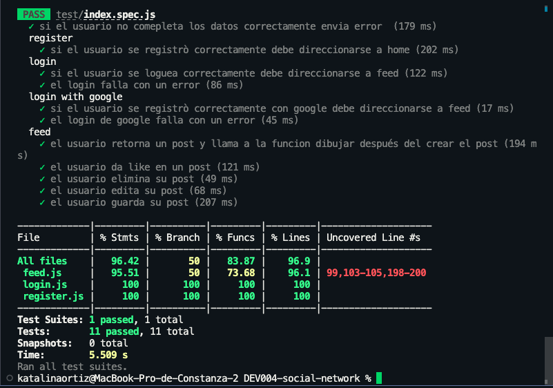

